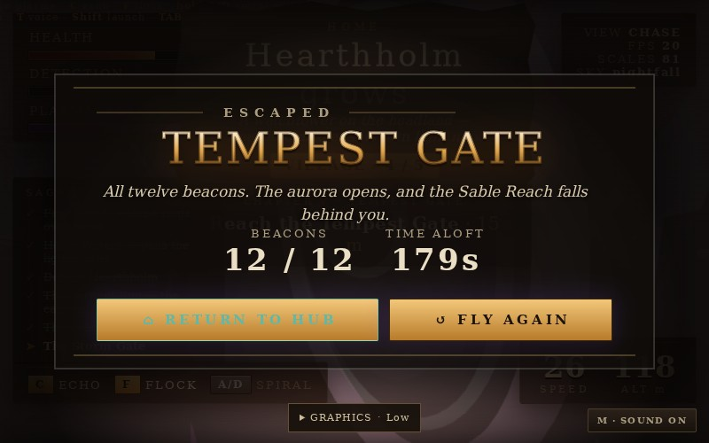

# Full main campaign verification

The final input-driven run completed all three tutorial rings, both Hearthholm raid waves, all twelve beacons and the Tempest Gate. The victory screen showed **ESCAPED**, **12 / 12**, and **179s**. Saved completion was `galevein_story_done=1`, and the game returned to the hub.

| Result | Final run |
|---|---:|
| Simulated flight time | 179.1 seconds |
| Charged shots released | 7 |
| Hearthholm health | 100 |
| Dragon health at completion | 61.8 |
| Minimum sampled dragon health | 19.9 |
| Browser exceptions | 0 |

## Method

`campaign-run.mjs` launches Chromium with SwiftShader, fresh local storage, Low graphics, and RNG seed 104. It clicks Start → Story, dismisses chapter pages through the UI, and steers using the existing flight-control interface. Read-only campaign telemetry provides enemy positions for a targeting driver. Shots are ordinary X keydown/keyup events dispatched to the body. The real game rules advance in 1/60-second steps. Normal browser frames also run, so timings and collision outcomes can vary slightly between repetitions.

No teleports, checkpoint jumps, score changes, health overrides, injected enemies/projectiles or forced victory were used. The dragon survived collisions and recovered through normal regeneration. This is an accelerated automated main-story run, not a human playthrough or proof of all optional tasks, watchtower destruction or perfect canyon gates. Software rendering does not establish native GPU FPS, audio quality or human control feel.

## Bug found and fixed

A repeat run hit a genuine exception: a charged plasma impact requested media volume 1.05, outside HTMLMediaElement's 0–1 range. The audio adapter now clamps load, play and fade volumes. `audio-volume.test.mjs` exercises the actual adapter with browser-equivalent range validation, including boosted impacts and completed fades. The full campaign passed again after this fix.

## Evidence

- `campaign-evidence/results.json`: final run samples, completion state, ending DOM, saved completion and hub return.
- `campaign-evidence/source-hashes.json`: SHA-256 of tested source and driver.
- `campaign-evidence/attempts/completed-arrival.json`: earlier successful main campaign, before explicit ending/hub assertions.
- `campaign-evidence/attempts/impact-audio-error.json`: preserved production audio failure before the fix.
- `campaign-evidence/attempts/driver-event-target.json` and `driver-ammo-rounding.json`: failed harness development runs. The driver now dispatches keyboard events to the body and confirms charging actually began rather than relying on rounded ammo telemetry.



The screenshot is JPEG-compressed from the browser's PNG capture.

## Reproduce

Set `CODEX_PRIMARY_RUNTIME_NODE_MODULES` to installed Playwright and `CHROMIUM_EXECUTABLE` to Chromium with SwiftShader libraries, then run from the repository root:

```sh
node --test reports/flight-polish/audio-volume.test.mjs
node reports/flight-polish/campaign-run.mjs
```

The campaign harness starts its own local HTTP server. It exits unsuccessfully if completion, ending persistence, hub return or exception checks fail.
