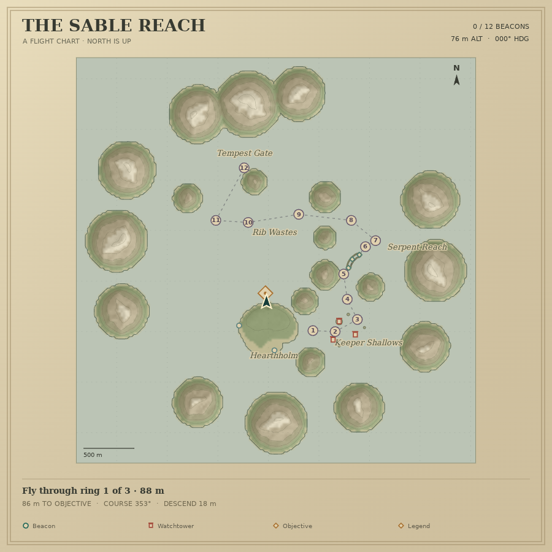
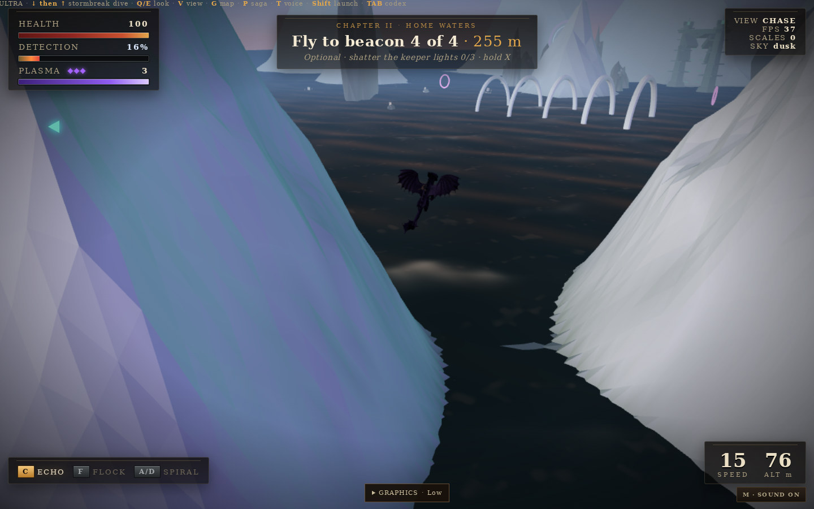

# Flight, terrain and combat upgrade

Based on `Arnie016/dragon-storm-game` commit `fa93db13a765dfbfcd5ba47420a015db4bf9d5bc`.
The existing story, route, water shader, audio, dragon assets and HUD design remain the foundation.

## Changes

- Five persisted graphics levels: **Low, Medium, High, Extra High, Extreme**. Landing and in-flight controls scale resolution, rain/trails, sea tessellation, terrain detail distance and dragon shadows. Extra High/Extreme add cinematic depth using one color/depth scene render, eliminating the previous second full-scene depth render.
- Ridged fjord mountains with mossy low slopes and slope-dependent snow replace cones and snow caps. Mountains never cast or receive shadows. Three geometry detail levels reduce distant cost; flight and projectile terrain stay fixed across quality settings.
- Parchment navigation chart with actual coastlines/contours, numbered beacon progress, heading, objective course/distance/height, tutorial/canyon gates and tower status.
- Stabilized dragon animation: fixed non-finite boost animation speed, missing wing signs, shared/missing clips, procedural bone accumulation, variant scale and replaced-model cleanup.
- Combat with cover-aware aim assistance, target brackets and exact damage feedback, charged attacks, continuous projectile collision, terrain obstruction, cancellable tower wind-up and protection against overlapping volleys.
- Story/retry cleanup preserves earned upgrades while resetting transient state. Chapter launch preserves its spawn. Escape, focus loss and menus pause flight and clear controls; stale callbacks cannot alter a new run.
- Mountain near-misses retain reduced wind and detection. Graphics controls no longer overlap the opening prompt, and Resume accepts pointer input through the HUD.
- Audio levels are clamped to the browser’s valid range, fixing a charged-impact exception discovered during the full campaign run.
- Frame timing now records raw browser intervals instead of hiding stalls behind the simulation timestep cap. Render counts include all passes.

## Verification

Results from the final recovered checkout are saved alongside reproducible scripts. Earlier screenshots and ledgers were removed by workspace maintenance and are not presented as final evidence.

| Check | Evidence |
|---|---|
| Projectile/profile regression | `regression.test.mjs`: 15 tests passed |
| Mountain physics/render agreement | `terrain-check.mjs`, `terrain-result.json`: mesh comparisons, exact segment occlusion, route clearance, quality invariance and no mountain shadows |
| Navigation chart | `navigation-map-check.mjs`, `navigation-map-result.json`: terrain cache, live overlay redraw, invalidation and disposal |
| Rig/lifecycle/graze stability | `stability-result.json`: 3,600 animation frames, 20 reset cycles, impact cooldowns and wind damping passed |
| Browser integration | All five quality controls, five dragon variants, six chapter initializations, pause/resume, map, charged tower hit and retry passed; see `BROWSER_VERIFICATION.md` |
| Confirmed enemy hit | `combat-confirmation/results.json`: 3/3 checks passed; actual projectile reduced HP 100 → 84 and triggered 0.55 seconds of hit protection |

Run CPU checks from the repository root:

```sh
node --test reports/flight-polish/regression.test.mjs
node reports/flight-polish/terrain-check.mjs
node reports/flight-polish/navigation-map-check.mjs
node reports/flight-polish/stability-check.mjs
```

The chart preview uses the actual terrain with synthetic progression. Browser and combat test setup is declared in each ledger. Synthetic repositioning does not count as campaign progress.

## Performance and completion limits

The available browser uses SwiftShader, a software GPU. Its frame timings cannot establish native-device performance. No 60/120 FPS claim is made. Audio quality, control feel and sustained native-GPU performance need a hands-on target-device run.

Graphics settings change cosmetic budgets; essential combat cues and physics do not depend on the selected level. Terrain geometry counts establish reduced rendering work, not a measured FPS improvement.

## Playthrough extent

The input-driven main campaign now completes: all three tutorial rings, both village raid waves, all twelve beacons, and `ESCAPED` at the Tempest Gate. The successful run used seven charged shots and finished with Hearthholm at 100 health and the dragon at 61.8 health. It used accelerated simulation with normal controls, no teleports or health/progress overrides. See [campaign verification](CAMPAIGN.md) for the full method and raw evidence. Optional side objectives and a human playthrough are not covered by this completion claim.

Final-source boot/render checks reported no uncaught exceptions. See [the browser verification ledger](BROWSER_VERIFICATION.md) for exact setup, evidence versions and remaining limitations.

## Captures

These captures come from actual browser output. The chart uses lossless WebP; the flight image uses JPEG compression. The chart reflects live game state. The Low-preset flight capture uses a diagnostic camera; it is not evidence of a normal-play camera or maximum-quality graphics.




